<h1 class="title topictitle1 ibm-h1" id="H11">Tutorial: Debugging a decision service in Rule Designer</h1>

This tutorial provides a methodology for debugging a decision service in Rule
Designer.

<h2 class="title sectiontitle ibm-h4 ibm-padding-top-1" id="H21">Audience</h2>

This tutorial is for people who develop decision services in IBM Operational Decision Manager on Cloud Decision Server Rule Designer.

<h2 class="title sectiontitle ibm-h4 ibm-padding-top-1" id="H21">Features</h2>

You use debugging features to find and fix errors in a decision service:

<ul class="ul ibm-colored-list ibm-textcolor-gray-80" id="UL1"><li class="li" id="LI1">Automatic exception handling</li>
<li class="li" id="LI2">Breakpoints in a ruleflow, action rule, and decision table</li>
<li class="li" id="LI3">Debugging session</li>
<li class="li" id="LI4">Error and console messages</li>
</ul>
<h2 class="title sectiontitle ibm-h4 ibm-padding-top-1" id="H21">Requirements</h2>

You need the following component, projects and information:

<ul class="ul ibm-colored-list ibm-textcolor-gray-80" id="UL1">
<li class="li" id="LI2">Operational Decision Manager on Cloud Decision Server Rule Designer: You must download this component from the IBM ODM on Cloud portal.</li>
<li class="li" id="LI3">The project files that you download from this GitHub resource:
<ul class="ul ibm-colored-list ibm-textcolor-gray-80" id="UL1">
<li class="li" id="LI1"><samp class="ph codeph"><i>DownloadDir</i>/answer</samp>: This file contains the completed version of the decision service. You can run it to see the expected results.</li>
<li class="li" id="LI2"><samp class="ph codeph"><i>DownloadDir</i>/start</samp>: This file contains the faulty version of the decision service. You look for errors in it during the debugging process.</li>
</ul></li>
<li class="li" id="LI4">Knowledge of business rule programming principles, Java™, and the Eclipse environment</li>
</ul>

<h2 class="title sectiontitle ibm-h4 ibm-padding-top-1" id="H21">Learning objectives</h2>

You use debugging features to find and fix errors in a decision service. This tutorial includes
the following tasks:

<ul class="ul ibm-colored-list ibm-textcolor-gray-80" id="UL1"><li class="li" id="LI1">Using automatic exception handling</li>
<li class="li" id="LI2">Setting breakpoints in a ruleflow, action rule, and decision table</li>
<li class="li" id="LI3">Running a debugging session</li>
<li class="li" id="LI4">Identifying and fixing errors</li>
</ul>

<strong class="ph b" id="STRONG1">Best practices</strong>

This tutorial covers the following best practices for debugging decision services:

<ul class="ul ibm-colored-list ibm-textcolor-gray-80" id="UL2"><li class="li" id="LI5">Carefully read the error messages. They tell you where to look for errors.</li>
<li class="li" id="LI6">Try automatic exception handling when an exception occurs in a rule condition.</li>
<li class="li" id="LI7">Check the stack trace to get the names of ruleflows and rule tasks.</li>
<li class="li" id="LI8">Switch to the debug mode to get more precise error information.</li>
<li class="li" id="LI9">Use the rule search to find artifacts, and the Java search to find Java XOMs.</li>
<li class="li" id="LI10">Use queries to find rules by their content.</li>
<li class="li" id="LI11">Check the values in the Variables view at each breakpoint during debugging.</li>
<li class="li" id="LI12">Check the Agenda view to see which rules are going to be run.</li>
</ul>

<h2 class="title sectiontitle ibm-h4 ibm-padding-top-1" id="H22">Time required</h2>

This tutorial takes about 40 minutes to complete.

<h2 class="title sectiontitle ibm-h4 ibm-padding-top-1" id="H22">More information</h2>

Use these links to find additional information:

<ul class="ul ibm-colored-list ibm-textcolor-gray-80" id="UL2"><li class="li" id="LI5"><a href="https://www.ibm.com/support/knowledgecenter/SS7J8H/welcome/kc_welcome_cloud.html">IBM Operational Decision Manager on Cloud Knowledge Center</a></li>
<li class="li" id="LI6"><a href="https://www.ibm.com/support/knowledgecenter/SS7J8H/com.ibm.odm.cloud.tutorial/topics/con_tutorials_intro.html">IBM ODM on Cloud Tutorials</a></li>
<li class="li" id="LI7"><a href="https://www.ibm.com/support/knowledgecenter/SS7J8H/com.ibm.odm.cloud.develop/topics/odm_cloud_develop.html">Developing decision services in Rule Designer</a></li>
<li class="li" id="LI8"><a href="https://www.ibm.com/support/knowledgecenter/SS7J8H/com.ibm.odm.dserver.rules.designer.run/debugging_topics/tpc_running_debugging.html">Running and debugging in Rule Designer</a></li>
<li class="li" id="LI9"><a href="https://www.ibm.com/support/knowledgecenter/SS7J8H/com.ibm.odm.cloud.tutorial/topics/tsk_install_rd_fullpackage.html">Installing a stand-alone version of Rule Designer</a></li>
<li class="li" id="LI10"><a href="https://www.ibm.com/support/knowledgecenter/SS7J8H/com.ibm.odm.cloud.tutorial/topics/tsk_install_rule_designer.html">Installing Rule Designer in an existing Eclipse environment</a></li>
<li class="li" id="LI11"><a href="https://www.ibm.com/support/knowledgecenter/SS7J8H/com.ibm.odm.cloud.troubleshooting/topics/odm_cloud_troubleshooting.html">Troubleshooting and support</a></li>
<li class="li" id="LI12"><a href="https://www.ibm.com/us-en/marketplace/operational-decision-management">IBM Operational Decision Manager on Cloud</a></li>
<li class="li" id="LI13"><a href="http://www.ibm.com/support/docview.wss?uid=swg27046500">IBM Operational Decision Manager on Cloud - Detailed System Requirements</a></li>
<li class="li" id="LI14"><a href="https://developer.ibm.com/odm/docs/frequently-asked-questions/odm-on-cloud-faq/">Operational Decision Manager on Cloud FAQ</a></li>
</ul>

<h2 class="title sectiontitle ibm-h4 ibm-padding-top-1" id="H22">Licensing information</h2>

Copyright IBM Corp. 1987, 2017. Licensed to the Apache Software Foundation (ASF) under one or more contributor license agreements.  See the NOTICE file distributed with this work for additional information regarding copyright ownership.  The ASF licenses this file to you under the Apache License, Version 2.0 (the "License"); you may not use this file except in compliance with the License.  You may obtain a copy of the License at <a href="http://www.apache.org/licenses/LICENSE-2.0">http://www.apache.org/licenses/LICENSE-2.0</a>. Unless required by applicable law or agreed to in writing, software distributed under the License is distributed on an "AS IS" BASIS, WITHOUT WARRANTIES OR CONDITIONS OF ANY KIND, either express or implied.  See the License for the specific language governing permissions and limitations under the License.

<h1 class="title topictitle1">Before you start</h1>

In this tutorial, you work as a developer for a fictitious loan company. You are currently
working on a decision service that validates loan requests. Called the Loan Validation Service, the
decision service applies several criteria to determine the eligibility of potential borrowers, and
contractual constraints for approved loans. 

A business user is reviewing the results of the decision service. The user contacts you to tell
you that the decision service rejects low-risk loans that actually qualify for approval. You must debug the decision service to determine why it rejects the loans. 

In Rule
Designer, you tag rule
artifacts with breakpoints that stop the running of the decision service at key points. You can then
examine the behavior of the rules in a step-by-step debugging process. You determine where the
errors take place, and track them to specific rules. Then, you modify the rules to fix the
errors.

<h4 class="sectiontitle">Lessons in this tutorial</h4>
<ul>
<li><strong>Running the completed decision service</strong> You run the completed version of the decision service to see the expected
results.</li>
<li><strong>Task 1: Using automatic exception handling</strong> 
You import and run the faulty decision service. You find an exception error in a rule,
and try to fix the problem by using automatic exception handling. </li>
<li><strong>Task 2: Setting breakpoints</strong> 
You set breakpoints to determine where a null pointer exception occurs.</li>
<li><strong>Task 3: Debugging a rule</strong> 
You set breakpoints in a rule and run a debug session. When you find an error, you make
changes to correct it. </li>
<li><strong>Task 4: Debugging a decision table</strong> 
You add breakpoints to an action rule and a decision table, and then run a debugging
session to find and fix an error.</li>
<li><strong>Task 5: Debugging a ruleflow</strong> 
You debug a ruleflow to determine why the decision table does not approve the loan. When
you find the cause, you reorganize the ruleflow to achieve the correct results.</li>
</ul>

<h1 class="title topictitle1">Running the completed decision service</h1>

You run the completed version of the decision service to see the expected
results. It contains the changes that you make in the tutorial. It
produces the results that you can expect to achieve at the end of the tutorial.

<b>Tip:</b> 
If
you want to refer to the completed decision service while you are going through the tutorial, use
the <samp class="ph codeph">answer</samp> and <samp class="ph codeph">start</samp> projects in different Eclipse
workspaces.

 
<ol class="ol steps">
<li class="li step stepexpand">Start Rule Designer on your computer in the en_US (American English) locale.</li>
<li class="li step stepexpand">Import the <samp class="ph codeph">answer</samp> project that you downloaded from GitHub.
<ol class="ol steps">
<li class="li step stepexpand">Close the Eclipse Welcome page to see the Rule perspective. If the Rule perspective is not open, click Window > Open Perspective > Other > Rule to open the perspective.</li>
<li class="li step stepexpand">Click File > Import. In the Import wizard, expand General > Existing Projects into Workspace, and click Next.</li>
<li class="li step stepexpand">Choose Select root directory. Browse to <samp class="ph codeph"><i>DownloadDir</i>/answer</samp>, click Select All, and in Options, click Copy projects into workspace.</li>
<li class="li step stepexpand">Click Finish.</li>
</ol>

The Rule Explorer displays six
projects:

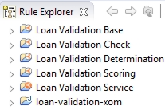</img>

The Java™ project loan-validation-xom defines an execution object model
(XOM) for rule execution. The main decision service, Loan Validation Service,
references the other projects.
</li>
<li class="li step stepexpand">From the Run menu, select Run
Configurations.</li>
<li class="li step stepexpand">Expand Decision Operation, and click the run loan
validation configuration: 
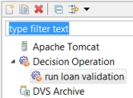</img>
</li>
<li class="li step stepexpand">Click Run. The Console view displays the following results, which show that the input data is valid and
the loan is approved:
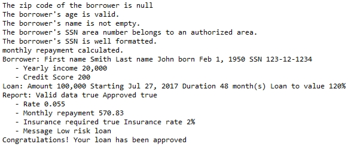</img>
</li>
</ol>
<h1 class="title topictitle1">Task 1: Using automatic exception handling</h1>

Before you make any changes to the faulty decision service, you want to see the results
that it produces. You import the decision service into Rule
Designer, and then run it. The results show
a null pointer exception in a rule condition. Before going further, you activate the automatic
exception handling feature to see whether it can correct the exception. 

<h2 class="title topictitle2">Step 1: Running the decision service</h2>

You import the start projects for the tutorial, and run the decision
service. 

<b>Important:</b> 
If you have imported the <samp class="ph codeph">answer</samp> projects to run the completed tutorial, delete the projects before importing the <samp class="ph codeph">start</samp> projects into the same Eclipse workspace.

 
<ol class="ol steps">
<li class="li step stepexpand">Start Rule Designer on your computer in the en_US (American English) locale. </li>
<li class="li step stepexpand">Import the <samp class="ph codeph">start</samp> project that you downloaded from GitHub.
<ol class="ol steps">
<li class="li step stepexpand">Close the Eclipse Welcome page to see the Rule perspective. If the Rule perspective is not open, click Window > Open Perspective > Other > Rule to open the perspective.</li>
<li class="li step stepexpand">Click File > Import. In the Import wizard, expand General > Existing Projects into Workspace, and click Next.</li>
<li class="li step stepexpand">Choose Select root directory. Browse to <samp class="ph codeph"><i>DownloadDir</i>/start</samp>, click Select All, and in Options, click Copy projects into workspace.</li>
<li class="li step stepexpand">Click Finish.</li>
</ol>
Eclipse switches to the Rule perspective. The Rule Explorer displays six
projects:

</img>

The Java™ project loan-validation-xom defines an execution object model
(XOM) for the rules. The main decision service, Loan Validation Service,
references the other projects.
</li>
<li class="li step stepexpand">From the Run menu, select Run
Configurations.</li>
<li class="li step stepexpand">Expand Decision Operation, select the run loan validation configuration, and click
Run. 
The Console view shows the results, which include the following exception error:

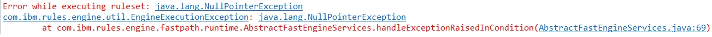</img>
</li>
</ol>

<h2 class="title topictitle2">Step 2: Applying automatic exception handling</h2>

Because the exception occurs in a rule condition, you decide to try to fix it by using
automatic exception handling.

 
<ol class="ol steps"><li class="li step">In the Rule Explorer, right-click Loan Validation Service.</li>
<li class="li step">In the pop-up menu, click Properties, and select Rule Engine in the left column of the Properties dialog.</li>
<li class="li step">Select Automatic exception handling in conditions, and then click
OK: 
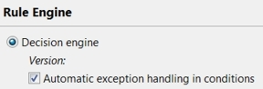</img>
</li>
<li class="li step">Run the run configuration that is shown in step 1 of this task. The results no longer show an exception error. The decision engine automatically handles the
exception. To determine where the exception takes place, you add more logging information to the
results.</li>
</ol>

<h2 class="title topictitle2">Step 3: Adding exception handing logging</h2>

You add additional logging information to determine where the decision engine automatically
handles the exception error. First, you look at the file, and set it as
the logging configuration file. Then, you set the Java VM parameter of the run configuration to declare the
path to the logging configuration file.

 
<ol class="ol steps"><li class="li step stepexpand">In the Rule Explorer, double-click Loan Validation
Service/logging.properties. The file sets the Console as a logging handler: 
<samp class="ph codeph">handlers =
java.util.logging.ConsoleHandler</samp>

It also sets the log level for the automatic
exception handling to <samp class="ph codeph">FINE</samp>.

</li>
<li class="li step stepexpand">Open Run &gt; Run Configurations, and select the run loan validation configuration.</li>
<li class="li step stepexpand">Open the Parameters and Arguments tab, and add the following VM
argument:  <pre class="pre codeblock"><code>-Djava.util.logging.config.file="${workspace_loc}/Loan Validation Service/logging.properties"</code></pre>
</li>
<li class="li step stepexpand">Click Apply, and then click Run. The Console shows the results, which include a log message for the automatic exception
handling:
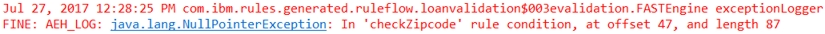</img>

The results tell you that the exception takes place in a condition in the
checkZipcode rule. 

</li>
</ol>

<h3 class="sectiontitle tasklabel" id="taskd9427e258">What to do next</h3>
In the next task, you add breakpoints to a ruleflow to determine where the exception
handling occurs.

<h1 class="title topictitle1">Task 2: Setting breakpoints</h1>

You look at the automatic exception handling log message:

</img>

It lists the loanvalidation ruleflow and its validation
rule task as follows:

<samp class="ph codeph">ruleflow.loanvalidation$003evalidation</samp>

You decide to track the processes in the task by placing a breakpoint on it. Then, you search for
the rule that produces the error, add tracing, and then run a debug configuration.

<h2 class="title topictitle2">Step 1: Setting a breakpoint</h2>

You run the decision service, search for the source of an error, and add a breakpoint. 

 
<ol class="ol steps"><li class="li step stepexpand">Run the decision service as shown in Task 1: Using automatic exception handling. The results contain the following error code:

<samp class="ph codeph">ruleflow.loanvalidation$003evalidation</samp>

You understand the code as
follows:

<ul class="ul"><li class="li">Ruleflow name: <samp class="ph codeph">loanvalidation</samp></li>
<li class="li">Rule task: <samp class="ph codeph">validation</samp></li>
</ul>

You want to find the validation task in the loanvalidation
ruleflow.

</li>
<li class="li step stepexpand">Click Search &gt; Search in the toolbar.</li>
<li class="li step stepexpand">Open the Rule Search tab.</li>
<li class="li step stepexpand">Enter loanvalidation in the search field.

<b>Tip:</b> You can copy the name of the ruleflow in the error message, and paste it in the
search field.

</li>
<li class="li step stepexpand">Select Ruleflow, and then click Search. The loanvalidation ruleflow is displayed in the Search view:
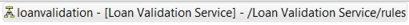</img>
</li>
<li class="li step stepexpand">Double-click the ruleflow in the Search view to open it.</li>
<li class="li step stepexpand">Click the validation task to select it.</li>
<li class="li step stepexpand">Right-click the task and click Toggle Breakpoint at the bottom of the
pop-up menu to tag the task with a breakpoint. The task now shows a dot to indicate the addition of the breakpoint:
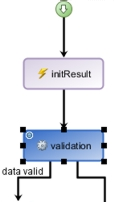</img>
</li>
</ol>

<h2 class="title topictitle2">Step 2: Preparing the debug session</h2>

Because the checkZipcode action rule shows an exception, you look for
the rule and add trace information to it.

<b>Tip:</b> In this step, you navigate to the action
rule through the Rule Selection tab of the properties of the ruleflow task.
Optionally, you can do a rule search in Search to find the action rule by
name.

 
<ol class="ol steps"><li class="li step stepexpand">Look at the automatic exception handling message. You see that the null pointer exception occurs in the checkZipcode rule
condition: 
<samp class="ph codeph">FINE: AEH_LOG: java.lang.NullPointerException: In 'checkZipcode' rule
condition</samp>

</li>
<li class="li step stepexpand">Double-click the validation task in the loanvalidation
ruleflow.</li>
<li class="li step stepexpand">In the Properties tab, click Rule Selection and expand the
validation package.</li>
<li class="li step stepexpand">Expand borrower, and double-click the checkZipcode
action rule to open it in the rule editor. You see that the condition in the rule uses the length of the zip code. You want to know the
value of the zip code, so you add trace information to print the value.</li>
<li class="li step stepexpand">Go back to the loanvalidation ruleflow in the ruleflow editor.</li>
<li class="li step stepexpand">Double-click the validation task. </li>
<li class="li step stepexpand">In the Properties view, select Initial action. Keep Use BAL
for action selected.</li>
<li class="li step stepexpand">Add the following code to display the borrower zip code: 
<samp class="ph codeph">print "The zip code of the borrower is " + the zip code of the address of 'the borrower'
;</samp>

The code looks as follows:
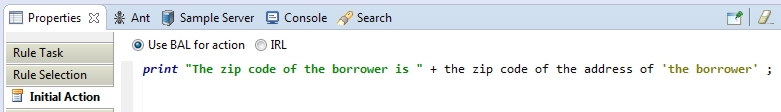</img>

</li>
<li class="li step stepexpand">Save your work.</li>
</ol>

<h2 class="title topictitle2">Step 3: Running the debugger on a ruleflow</h2>

You run a debug configuration to check the values of the borrower zip code. You are looking
for null values to determine where the null pointer exception occurs.

 
<ol class="ol steps"><li class="li step stepexpand">Click Run &gt; Debug Configurations in the toolbar. </li>
<li class="li step stepexpand">Open the run loan validation configuration and click
Debug.</li>
<li class="li step stepexpand">If the Save and Launch dialog opens, click OK to save your changes
before running the debugger.</li>
<li class="li step stepexpand" id="bp3__debug1">Click Yes in the Confirm Perspective Switch dialog box to open the debug
perspective. The debugger stops at the beginning of the validation rule task, at the breakpoint that you
set in step 1 of this task.</li>
<li class="li step stepexpand" id="bp3__variables1">Expand borrower in the Variables tab. Notice the null values for latestBankruptcy, spouse, and
<samp class="ph codeph">zipCode</samp>: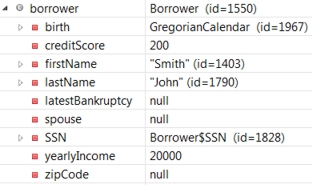</img></li>
<li class="li step stepexpand">Click the Resume button </img>. The results in the Console view begin with the following message: 
 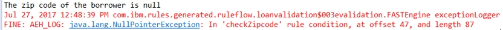</img>
 
The first line is the trace that you added to the initial action of the
validation task. You see that the automatic exception handling catches the null
pointer exception because of the null zip code in the checkZipcode rule. The
condition part has an unknown status, so the rule is ignored. You tell the business user that the
borrower in the configuration has a null zip code, and you are told that it is not a problem.

The automatic exception handling correctly addresses the problem. You can remove the trace
for the logging information that comes from the automatic exception handling. You keep the trace on
the initial action of the validation task to get the zip code value.

<b>Note:</b> The Console shows the AEH_LOG message twice. Because the
checkZipcode rule contains a then action and an
else action, its condition part is evaluated twice, producing two
AEH_LOG messages.

</li>
<li class="li step stepexpand">Switch to the Rule perspective.</li>
<li class="li step stepexpand">Click Run &gt; Run Configurations, and open the run loan validation configuration.</li>
<li class="li step stepexpand">Delete the VM arguments from the Parameters and Arguments tab.</li>
<li class="li step stepexpand">Click Apply, and then Run.  The automatic exception handling trace information is no longer shown. However, the loan is
still not approved, so there are more errors to fix:
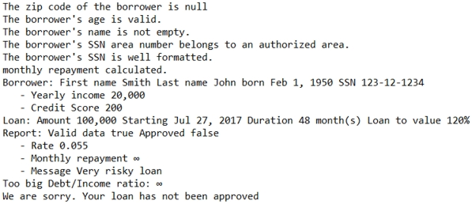</img>
</li>
</ol>

<h3 class="sectiontitle tasklabel" id="taskd6454e406">What to do next</h3>
You see in the output that the monthly repayment value has an infinite value, which is not
normal. In the next task, you look for the rule that generates the value.

<h1 class="title topictitle1">Task 3: Debugging a rule</h1>

When you run the decision service, it does not generate the correct monthly repayment rate.
In the results, the rate is prefaced with the variable name <samp class="ph codeph">monthly repayment</samp>. You
create a query to find the rule that uses the variable in an action. Then, you place a breakpoint on
the action in the rule, and another breakpoint on the code that computes the monthly repayment rate.
You run a debugging session, which leads you to an error in the Java code, which you try to
fix.

<h2 class="title topictitle2">Step 1: Setting a breakpoint in a rule</h2>

You create a query to find the action rule that uses the variable monthly
repayment, and then add a breakpoint to track the rule.

 
<ol class="ol steps"><li class="li step stepexpand">Run the decision service as shown in Task 1: Using automatic exception handling. In the results, you see that the report does not show the correct monthly repayment value. You
want to find the source of this value to determine how to fix it.</li>
<li class="li step stepexpand">In the Rule Explorer, expand the Loan Validation Service project.</li>
<li class="li step stepexpand" id="rule1__query1">Right-click the queries folder, and click New &gt; Query.</li>
<li class="li step stepexpand">Enter "Monthly" as the name in the New Query dialog, and click
Finish.</li>
<li class="li step stepexpand">Click &lt;enter a condition&gt; and add search parameters to form the
following query: 
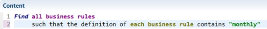</img>

<b>Tip:</b> The search function is case sensitive. Enter the name of the variable as you expect
to find it in the action rule.

</li>
<li class="li step stepexpand">Click Run query, and click Yes in the Save
Resource dialog. The Search view shows the repayment action rule because it contains the
word monthly:
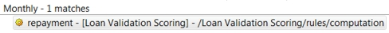</img>
</li>
<li class="li step stepexpand">Double-click the action rule in the Search view to open it in the rule editor. You see that the first action, line 7, sets the value of the monthly repayment
variable.</li>
<li class="li step stepexpand">Right-click line 7, and then click Toggle Breakpoint in the pop-up
menu: A breakpoint is displayed next to the line:
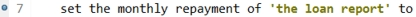</img>

In the next step, you look for the code that computes the value.

</li>
</ol>

<h2 class="title topictitle2">Step 2: Setting a breakpoint in a XOM</h2>

You set a breakpoint in the XOM code that produces the monthly repayment amount.

 
<ol class="ol steps"><li class="li step stepexpand">Open the ARL tab. It shows the Advanced Rule Language that is applied by the action rule. 
The definition of the rule has three main
parts: the definition of the variables, the condition part beginning with <samp class="ph codeph">when</samp>, and
the action part beginning with <samp class="ph codeph">then</samp>. You look in the action part of the rule. To
calculate the monthly repayment rate, the rule calls the
loan.LoanUtil.getMonthlyRepayment method. You add a breakpoint to the method to
further refine your search for the error.

</li>
<li class="li step stepexpand">In the Intellirule tab, hover over line 8 in the
repayment rule, press Ctrl, and click the line. The BOM member loan.LoanUtil.getMonthlyRepayment opens. The BOM to XOM
mapping section is empty, which means this member comes directly from the Java XOM. You decide to do
a search for the XOM member.</li>
<li class="li step stepexpand" id="rule2__search1">Open Search &gt; Search in the toolbar.  </li>
<li class="li step stepexpand">Open the Java Search tab, and enter
"getMonthlyRepayment" as the search string.</li>
<li class="li step stepexpand">Select Method in the Search For section, and
Declarations in the Limit To section: 
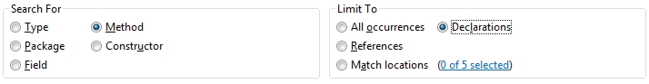</img>
</li>
<li class="li step stepexpand">Click Search. The search finds two declarations:
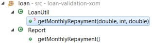</img>
</li>
<li class="li step stepexpand">Double-click loan.LoanUtil.getMonthlyRepayment to open it, and add a
breakpoint to the first instructions in the function: 
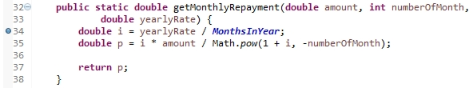</img>
</li>
</ol>

<h2 class="title topictitle2">Step 3: Debugging the action rule</h2>

You run a debugging session. When it stops at breakpoints, you look for reasons for the
monthly repayment error.

 
<ol class="ol steps"><li class="li step stepexpand">Run the run loan validation configuration in the Debug
Configurations.</li>
<li class="li step stepexpand">Click OK in the Save and Launch dialog if it opens, and click
Yes in the Confirm Perspective Switch dialog. The Debug perspective opens.</li>
<li class="li step stepexpand">The debugger stops at the validation task in the
loanvalidation ruleflow. Right-click the task, and click Toggle
Breakpoint to remove the breakpoint. You do not need this breakpoint for this task.</li>
<li class="li step stepexpand">Click the Resume button </img>. The Content view now shows the repayment action rule.</li>
<li class="li step stepexpand">Open the Variables tab and expand report. The monthlyRepayment variable shows <samp class="ph codeph">0.0</samp>.</li>
<li class="li step stepexpand">Click the Resume button </img>. The debugger stops at LoanUtil.java. The Java code shows the following method at the breakpoint:
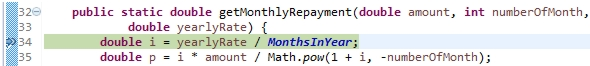</img>

The function computes a monthly repayment rate by dividing <samp class="ph codeph">yearlyRate</samp> by
MonthsInYear. In the Variables view, you see that the value of
MonthsInYear is 0. The error is that the function is dividing by 0, when it should
divide by 12.

</li>
<li class="li step stepexpand">Stop the debugging session by clicking the Terminate button </img>.</li>
</ol>

<h2 class="title topictitle2">Step 4: Fixing the error in the rule</h2>

You change the value of the MonthsInYear variable to 12, and run the decision
service to check the results.

 
<ol class="ol steps"><li class="li step stepexpand">Switch to LoanUtil.java in the Rule perspective.</li>
<li class="li step stepexpand">Change the value of the <samp class="ph codeph">MonthsInYear</samp> variable to 12: 
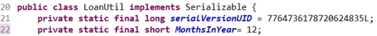</img>
</li>
<li class="li step stepexpand">Save your changes, and run the decision service normally by selecting the run loan
validation configuration in the Run Configurations. The Console now shows the correct monthly repayment rate of 570.83:
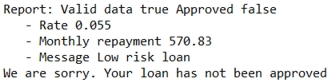</img>

However, the decision service still does not approve the loan, so you have more work to
do.

</li>
<li class="li step stepexpand">Remove all the breakpoints because you no longer need them: <ol class="ol" type="a"><li class="li">Open Window &gt; Show view &gt; Other.</li>
<li class="li">In the filter field, type "breakpoints" in the filter field, select
Breakpoints in the list, and click OK.</li>
<li class="li">Click the Remove All Breakpoints button </img>.</li>
</ol>
</li>
<li class="li step stepexpand">Save your work.</li>
</ol>

<h3 class="sectiontitle tasklabel" id="taskd5508e437">What to do next</h3>
You have corrected the monthly repayment error. In the next task, you debug a decision
table to try to fix the approval error.

<h1 class="title topictitle1">Task 4: Debugging a decision table</h1>

The decision service still doesn't approve the loan. You carefully read through the log in
the Console, and it leads you to a rule that determines whether a loan is approved under certain
conditions. You add a breakpoint to the rule, and look for the source of the decision in the
condition. This search takes you to a decision table, where you insert breakpoints. Using the
debugger, you trace the error to a value in the decision table, and then fix it.

<h2 class="title topictitle2">Step 1: Setting breakpoints in an action rule</h2>

You run a query to find the rule that contains the message <samp class="ph msgph">Your loan has not been
approved</samp>. Then, you add breakpoints to the rule.

 
<ol class="ol steps"><li class="li step stepexpand">Click Run &gt; Run Configurations, open the run loan validation configuration, and click
Run. 
The results from running the decision service still show an error. The output indicates that the
loan is low risk, but the decision service still does not approve the loan:

</img>

You decide to search for the rule that makes the rejection message by running a query for the
message.

</li>
<li class="li step stepexpand">In the Rule Explorer, expand the Loan Validation Service file.</li>
<li class="li step stepexpand">Right-click the queries folder, and click New &gt; Query. You create a query to find the rule that uses the rejection message <samp class="ph msgph">Your loan has not
been approved</samp>.

<b>Tip:</b> If you do not see the Query command in
the New menu, check that you are in the Rule perspective.

</li>
<li class="li step stepexpand">Enter "Approval" as the name in the New Query dialog, and click
Finish.</li>
<li class="li step stepexpand">Click &lt;enter a condition&gt; and add search parameters to create the
following query to look for the rejection message: 
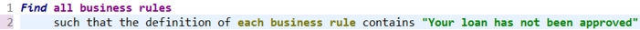</img>
</li>
<li class="li step stepexpand">Click Run query, and click Yes in the Save
Resource dialog. The Search view shows the approval action rule:
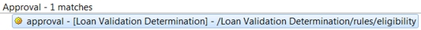</img>
</li>
<li class="li step stepexpand">Double-click the action rule in the Search view to open it in the rule editor. The action depends on the grade that is given to the loan. If the grade does not equal A, B or
C, the loan is
rejected:<pre class="pre codeblock"><code>if 
    'the grade' is one of { "A" , "B" , "C" } 
then 
    in 'the loan report', accept the loan with the message "Congratulations! Your loan has been approved" ;
else 
    in 'the loan report', refuse the loan with the message "We are sorry. Your loan has not been approved" ;</code></pre>
</li>
<li class="li step stepexpand">Place breakpoints on both actions (lines 4 and 6) in the approval action
rule: 
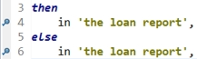</img>
 Now you search for the rule that computes the grade condition for the
approval rule.</li>
</ol>

<h2 class="title topictitle2">Step 2: Setting breakpoints in a decision table</h2>

The approval action rule applies a decision that is based on the grade
that is given to the loan. You decide to locate the rule that assigns grades to the loans. You
create a query that finds a decision table, and then you add breakpoints to the decision table to
observe it in a debugging session.

 
<ol class="ol steps"><li class="li step">Right-click the queries folder, and click New &gt; Query.</li>
<li class="li step">Name the query "gradeSet" and define the query by entering the following
search parameters: 
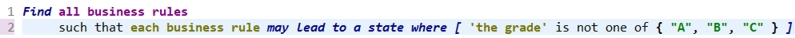</img>
 The query looks for a rule that can assign a grade that is not A, B or C, and therefore,
causes the decision service to reject the loan. </li>
<li class="li step">Run the query. The Search view shows the grade decision table, and lists the rows that
do not contain grade A, B or C:
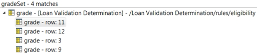</img>
</li>
<li class="li step">Double-click the decision table to open it in the decision table editor.</li>
<li class="li step">Select the <samp class="ph codeph">Grade</samp> column by clicking the column header cell. Right-click the
A cell in row 1, and click Toggle Breakpoint in the pop-up
menu. Every Grade cell now has a breakpoint:
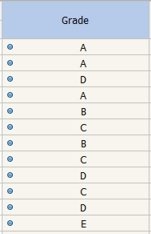</img>
</li>
</ol>

<h2 class="title topictitle2">Step 3: Debugging the decision table</h2>

You use a debugging session to find an error in the decision table.

 
<ol class="ol steps"><li class="li step stepexpand">Run the run loan validation configuration in the Debug
Configurations. The debugger stops at row 3, which shows grade D and the message Low
risk loan.</li>
<li class="li step stepexpand">Click the Resume button </img>. The debugger stops at the second breakpoint in the approval action rule. The loan is rejected
because the grade is D. The error is coming from row 3 of the grade decision
table.</li>
<li class="li step stepexpand">Click the Terminate button </img> to stop the debugging session. 
You contact the business user, who tells you to change the grade in row 3 to B.
You update the decision table to correct the error.

</li>
<li class="li step stepexpand">Open the grade decision table in the Rule perspective, and change the
grade in row 3 to B.</li>
<li class="li step stepexpand">Save your changes, and run the decision service normally by selecting the run loan
validation configuration in the Run Configurations. The results show that the loan is low risk, but the decision service still rejects the
loan.</li>
</ol>

<h3 class="sectiontitle tasklabel" id="taskd7657e307">What to do next</h3>
You have corrected the error in the decision table, but you are still not getting the
expected results. In the next task, you debug a ruleflow to fix the last error.

<h1 class="title topictitle1">Task 5: Debugging a ruleflow</h1>

The decision service still rejects the loan. The rules run correctly now, so you decide to
test the flow of decisions among the rules. You start by running a debugging session that associates
the error with two rules. You determine that the rules reside in the same rule task in a ruleflow.
This arrangement prevents one rule from processing information from the other rule. You reorganize
the ruleflow by adding a rule task to make sure that the condition part of one rule takes into
account the values that are computed in the action part of the other rule.

<h2 class="title topictitle2">Step 1: Debugging the ruleflow</h2>

You run a debugging session to determine the source of the error.

 
<ol class="ol steps"><li class="li step stepexpand">Run the run loan validation configuration in the Debug
Configurations. The debugger stops at row 3 of the grade decision table.</li>
<li class="li step stepexpand" id="rf1__agenda1">Open the Agenda tab in the Debug perspective. The tab shows two rules that are in the same eligibility rule task. The
first entry points to the rule that is formed by row 3 in the grade decision
table, and the second entry points to the approval action rule:
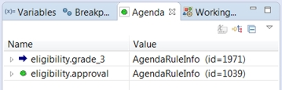</img>

In the grade decision table, you see that an arrow points to the
grade cell in row 3. The grade is B, and the message for the row is <samp class="ph msgph">Low risk
loan</samp>:

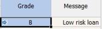</img>
</li>
<li class="li step stepexpand">Click the Resume button </img>.  The debugger stops on the else line in the approval
action rule, which rejects the loan:
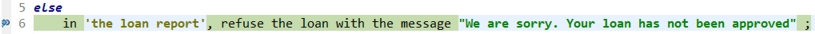</img>

You open the Variables view and look for the grade value. You see that
it is B as set in the grade decision table, but the action rule still goes to
the else condition, which is for any grade other than A, B or C. The grade value in the
approval rule is not set to B. The grade value is set in the decision table,
but it is not seen by the action rule. This disconnect between the rules indicates a ruleflow
problem. Both rules are probably in the same rule task. You look to see which algorithm is used by
the rule task. 

</li>
<li class="li step stepexpand">Click the Terminate button </img> to stop the debugging session.</li>
</ol>

<h2 class="title topictitle2">Step 2: Modifying the ruleflow</h2>

You open the eligibility rule task in the
loanvalidation ruleflow. The task uses an algorithm that prevents the
approval rule from seeing changes to data in another rule in the task. You
decide to reorganize the ruleflow by creating a task, and moving the approval
rule to the new task. Data can then flow from the old task to the new task, where the
approval rule can then see the data changes.

 
<ol class="ol steps"><li class="li step stepexpand">Open the loanvalidation ruleflow in the Rule perspective.</li>
<li class="li step stepexpand">Select the eligibility rule task. The rules in the Agenda tab are prefixed with
eligibility, which is the name of the rule task.</li>
<li class="li step stepexpand">Open Properties &gt; Rule Selection, and expand eligibility. You see that the task contains both the approval action rule and the
grade decision table.</li>
<li class="li step stepexpand">Open the Rule Task tab. You see that the Fastpath algorithm is selected:
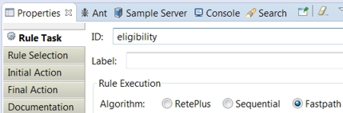</img>

You know that the Fastpath algorithm does not support inference. The agenda is computed
once in the rule task, but it is not changed if variables are modified by other rules in the task.
The approval rule runs with an unset grade value, and the value is not changed
by the grade decision table.

To fix the error, you decide to create a
rule task, and move the approval action rule to the new task. Then, you
organize the transitions so that data from the eligibility task flows to the
new task. This arrangement allows the approval rule to see the data from the
grade rule, which remains in the eligibility task.

</li>
<li class="li step stepexpand">Create a task node next to the insurance task in the ruleflow</a>. 
Enter the following parameters in the properties for the new task:

<ul class="ul"><li class="li">Rule Task ID: <samp class="ph codeph">approval</samp></li>
<li class="li">Rule Selection: <samp class="ph codeph">eligibility.approval</samp></li>
</ul>
</li>
<li class="li step stepexpand">Click the transition line from the eligibility task to the
end node, and reset it to run from the approval task to
the end node.</li>
<li class="li step stepexpand">Click the transition line from the eligibility task to the
insurance task, and reset it to run from the approval task
to the insurance task.</li>
<li class="li step stepexpand">Create a transition line between the eligibility task and the
approval task.</li>
<li class="li step stepexpand">Click the Layout All Nodes button </img>. The ruleflow now looks as follows:
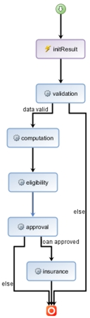</img>
</li>
<li class="li step stepexpand">Edit the eligibility task to remove the approval
action rule from the Rule Selection tab. Remove the eligibility package, and then import all the eligibility rules
except the approval rule:
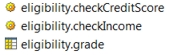</img>

Now, the grade decision table runs in the
eligibility task, and its grade value passes to the
approval rule in the approval task.

</li>
<li class="li step stepexpand">Save your work.</li>
<li class="li step stepexpand">Run the decision service by using the run loan validation configuration in
the Run Configurations. The decision service runs correctly, and produces the expected report:
</img>
</li>
<li class="li step stepexpand">Remove all the breakpoints as shown at the end of Task 3, and save your changes. Your decision
service now works correctly. You can now make the new version of the decision service available to
the business user for further review. 

<b>Tip:</b> In this tutorial, you created a new rule task in a ruleflow, and changed the rule
selection. This approach is not always possible. Alternatively, you can use inference by selecting
the RetePlus algorithm in the Rule Task properties of the eligibility task.

</li>
</ol>

<h3 class="sectiontitle tasklabel" id="taskd8669e377">Results</h3>

You have completed the tutorial. It showed you how to add breakpoints, and use a debugging
session to follow the breakpoints through a decision service to find problems in rules. 

<h2 class="title sectiontitle ibm-h4 ibm-padding-top-1" id="H21">Notice</h2>

© Copyright IBM Corporation 2017.

