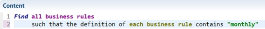
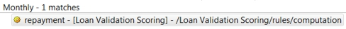
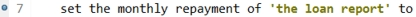
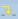
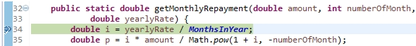
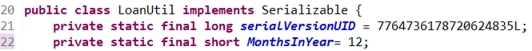
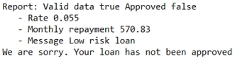

# Task 3: Debugging a rule

You set breakpoints in a rule and run a debug session. When you find an error, you make changes to correct it.

When you run the decision service, it does not generate the correct monthly repayment rate. In the results, the rate is prefaced with the variable name `monthly repayment`. You create a query to find the rule that uses the variable in an action. Then, you place a breakpoint on the action in the rule, and another breakpoint on the code that computes the monthly repayment rate. You run a debugging session, which leads you to an error in the Java code, which you try to fix.

## Step 1: Setting a breakpoint in a rule

You create a query to find the action rule that uses the variable monthly repayment, and then add a breakpoint to track the rule.

**Procedure**
1.   Run the decision service as shown in Task 1. In the results, you see that the report does not show the correct monthly repayment value. You want to find the source of this value to determine how to fix it.
2.   In the Rule Explorer, expand the Loan Validation Service project. 
3.   Right-click the queries folder, and click **New** \> **Query**. 
4.   Enter Monthly as the name in the New Query dialog, and click **Finish**. 
5.   Click **<enter a condition\>** and add search parameters to form the following query: 

**Tip:** The search function is case sensitive. Enter the name of the variable as you expect to find it in the action rule.

6.   Click **Run query**, and click **Yes** in the Save Resource dialog. The Search view shows the repayment action rule because it contains the word `monthly`:

7.   Double-click the action rule in the Search view to open it in the rule editor. You see that the first action, line 7, sets the value of the monthly repayment variable.
8.   Open the **ARL** tab. It shows the Advanced Rule Language that is applied by the action rule.

The rule has three main parts: the definition of the variables, the condition beginning with `when`, and the action beginning with `then`. In the action part, you see that the rule calls the `loan.LoanUtil.getMonthlyRepayment` method to calculate the monthly repayment rate. You must step into this method.

9.   Return to the rule editor, right-click line 7, and click **Toggle Breakpoint** in the pop-up menu. A breakpoint is displayed next to the line:

In the next step, you debug the action rule.

## Step 2: Debugging the action rule

You run a debugging session. When it stops at breakpoints, you look for reasons for the monthly repayment error.

**Procedure**
1.   Run the run loan validation configuration in the Debug Configurations. 
2.   Click **OK** in the Save and Launch dialog if it opens, and click **Yes** in the Confirm Perspective Switch dialog. The Debug perspective opens.
3.   The debugger stops at the validation task in the loanvalidation ruleflow. Right-click the task, and click **Toggle Breakpoint** to remove the breakpoint. You do not need this breakpoint for this task.
4.   Click the **Resume** button . The Content view now shows the repayment action rule.
5.   Open the **Variables** tab and expand report. The monthlyRepayment variable shows `0.0`.
6.   Click the **Step Into** button . The debugger stops at LoanUtil.java. The Java code shows the following method at the breakpoint:

The function computes a monthly repayment rate by dividing `yearlyRate` by `MonthsInYear`. In the Variables view, you see that the value of `MonthsInYear` is 0. The error is that the function is dividing by 0, when it should divide by 12.

7.   Stop the debugging session by clicking the **Terminate** button . 

## Step 3: Fixing the error in the rule

You change the value of the `MonthsInYear` variable to 12, and run the decision service to check the results.

**Procedure**
1.   Switch to LoanUtil.java in the Rule perspective. 
2.   Change the value of the `MonthsInYear` variable to 12: 

3.   Save your changes, and run the decision service normally by selecting run loan validation in the Run Configurations. The Console now shows the correct monthly repayment rate of 570.83:

However, the decision service still does not approve the loan, so you have more work to do.

4.   Remove all the breakpoints because you no longer need them:

a.  Open **Window** \> **Show view** \> **Other**.

b.  In the filter field, type breakpoints, select **Breakpoints** in the list, and click **OK**.

c.  Click the **Remove All Breakpoints** button .

5.   Save your work. 

You have corrected the monthly repayment error. In the next task, you debug a decision table to try to fix the approval error.

[**Next** ](../tut_cloud_rd_debug_ghtopics/tut_cloud_rddebug_dtable_lsn.md)

[ **Back to table of contents**](../README.md)

© Copyright IBM Corporation 2018

