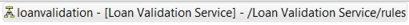
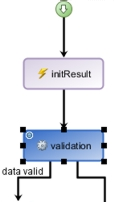
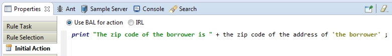
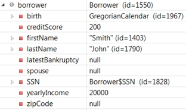
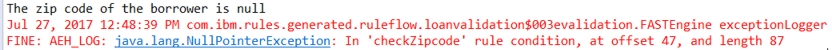
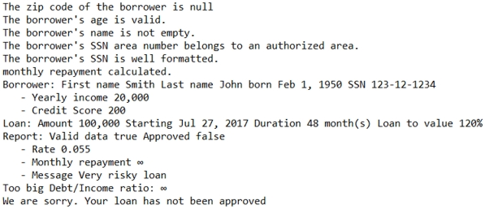

# Task 2: Setting breakpoints

You set breakpoints to determine where a null pointer exception occurs.

You look at the automatic exception handling log message:

It lists the loanvalidation ruleflow and its validation rule task as follows:

ruleflow.loanvalidation$003evalidation

You decide to track the processes in the task by placing a breakpoint on it. Then, you search for the rule that produces the error, add more tracing, and then run a debug configuration.

## Step 1: Setting a breakpoint

You run the decision service, search for the source of an error, and add a breakpoint.

**Procedure**
1.   Run the decision service as shown in Task 1. The results contain the following error code:

    ruleflow.loanvalidation$003evalidation

You understand the code as follows:

    -   Ruleflow name: `loanvalidation`
    -   Rule task: `validation`

You want to find the `validation` task in the `loanvalidation` ruleflow.

2.   Click **Search** \> **Search** in the toolbar. 
3.   Open the **Rule Search** tab. 
4.   Enter loanvalidation in the search field. 

**Tip:** You can copy the name of the ruleflow in the error message, and paste it in the search field.

5.   Select **Ruleflow**, and then click **Search**. The loanvalidation ruleflow is displayed in the Search view:

6.   Double-click the ruleflow in the Search view to open it. 
7.   Click the validation task to select it. 
8.   Right-click the task and click **Toggle Breakpoint** at the bottom of the pop-up menu to tag the task with a breakpoint. The task now shows a dot to indicate the addition of the breakpoint:

## Step 2: Preparing the debug session

Because the checkZipcode action rule shows an exception, you look for the rule and add trace information to it.

In this step, you navigate to the action rule through the **Rule Selection** tab of the properties of the ruleflow task. Optionally, you can do a rule search in **Search** to find the action rule by name.

**Procedure**
1.   Look at the automatic exception handling message. You see that the null pointer exception occurs in the checkZipcode rule condition:

    FINE: AEH_LOG: java.lang.NullPointerException: In 'checkZipcode' rule condition

2.   Double-click the validation task in the `loanvalidation` ruleflow. 
3.   In the Properties tab, click **Rule Selection** and expand the validation package. 
4.   Expand borrower, and double-click the checkZipcode action rule to open it in the rule editor. You see that the condition in the rule uses the length of the zip code. You want to know the value of the zip code, so you add trace information to print the value.
5.   Go back to the loanvalidation ruleflow in the ruleflow editor. 
6.   Double-click the validation task. 
7.   In the Properties view, select **Initial action**. Keep **Use BAL for action** selected. 
8.   Add the following code to display the borrower zip code: 

    print "The zip code of the borrower is " + the zip code of the address of 'the borrower' ;

The code looks as follows:

9.   Save your work. 

## Step 3: Running the debugger on a ruleflow

You run a debug configuration to check the values of the borrower zip code. You are looking for null values to determine where the null pointer exception occurs.

**Procedure**
1.   Click **Run** \> **Debug Configurations** in the toolbar. 
2.   Open the run loan validation configuration and click **Debug**. 
3.   If the Save and Launch dialog opens, click **OK** to save your changes before running the debugger. 
4.   Click **Yes** in the Confirm Perspective Switch dialog box to open the debug perspective. The debugger stops at the beginning of the validation rule task, at the breakpoint that you set in step 1 of this task.
5.   Expand borrower in the **Variables** tab. Notice the null values for `latestBankruptcy`, `spouse`, and `zipCode`: 
6.   Click the **Resume** button . The results in the Console view begin with the following message:

The first line is the trace that you added to the initial action of the validation task. You see that the automatic exception handling catches the null pointer exception because of the null zip code in the checkZipcode rule. The condition part has an unknown status, so the rule is ignored. You tell the business user that the borrower in the configuration has a null zip code, and you are told that it is not a problem.

The automatic exception handling correctly addresses the problem. You can remove the trace for the logging information that comes from the automatic exception handling. You keep the trace on the initial action of the validation task to get the zip code value.

**Note:** The Console shows the `AEH_LOG` message twice. Because the checkZipcode rule contains a `then` action and an `else` action, its condition part is evaluated twice, producing two `AEH_LOG` messages.

7.   Switch to the Rule perspective. 
8.   Click **Run** \> **Run Configurations**, and open the run loan validation configuration. 
9.   Delete the VM arguments from the **Parameters and Arguments** tab. 
10.  Click **Apply**, and then **Run**. The automatic exception handling trace information is no longer shown. However, the loan is still not approved, so there are more errors to fix:

You see in the output that the monthly repayment value has an infinite value, which is not normal. In the next task, you look for the rule that generates the value.

[**Next** ](../tut_cloud_rd_debug_ghtopics/tut_cloud_rddebug_arule_lsn.md)

[ **Back to table of contents**](../README.md)

© Copyright IBM Corporation 2018

