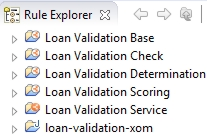

# Running the completed decision service

You run the completed version of the decision service. It contains the changes that you make in the tutorial, and produces the results that you can expect at the end of the tutorial.

**Tip:** If you want to refer to the completed decision service while you are going through the tutorial, use the answer and start projects in different Eclipse workspaces.

**Procedure**
1.   Start Rule Designer on your computer in the en\_US \(American English\) locale (see [Installing Rule Designer](https://www.ibm.com/support/knowledgecenter/SS7J8H/com.ibm.odm.cloud.tutorial/topics/tsk_install_rule_designer.html)). 
2.   Close the Eclipse welcome page if it is open. 
3.   Open the Rule perspective if it is not open. Click **Window** \> **Open Perspective** \> **Other** \> **Rule** to open the perspective. 
4.   Import the answer project that you downloaded from GitHub: 

a.  In the Rule perspective, click **File** \> **Import**.

b.  In the Import wizard, expand **General** \> **Existing Projects into Workspace**, and click **Next**.

c.  Choose Select root directory, and browse to <InstallDir\>/answer. InstallDir is the name of the directory to which you downloaded the answer project from GitHub.

d.  Click **Select All**, and in Options, click **Copy projects into workspace**.

e.  Click **Finish**.

The Rule Explorer displays six projects:

The Java™ project loan-validation-xom defines an execution object model \(XOM\) for rule execution. The main decision service, Loan Validation Service, references the other projects.

5.   Click **Run**. The Console view displays the following results, which show that the input data is valid and the loan is approved:

In the next task, you run the faulty version of the decision service and see the errors in the output.

[**Next** ](../tut_cloud_rd_debug_ghtopics/tut_cloud_rddebug_start_lsn.md)

[ **Back to table of contents**](../README.md)

© Copyright IBM Corporation 2018

