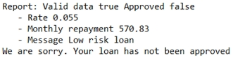

# Task 4: Debugging a decision table

You add breakpoints to an action rule and a decision table, and then run a debugging session to find and fix an error.

The decision service still doesn't approve the loan. You carefully read through the log in the Console, and it leads you to a rule that determines whether a loan is approved under certain conditions. You add a breakpoint to the rule, and look for the source of the decision in the condition. This search takes you to a decision table, where you insert breakpoints. Using the debugger, you trace the error to a value in the decision table, and then fix it.

## Step 1: Setting breakpoints in an action rule

You run a query to find the rule that contains the message Your loan has not been approved. Then, you add breakpoints to the rule.

**Procedure**
1.   Click **Run** \> **Run Configurations** , open the run loan validation configuration, and click **Run**. 

The results from running the decision service still show an error. The output indicates that the loan is low risk, but the decision service still does not approve the loan:

You decide to search for the rule that makes the rejection message by running a query for the message.

2.   In the Rule Explorer, expand the Loan Validation Service file. 
3.   Right-click the queries folder, and click **New** \> **Query**. You create a query to find the rule that uses the following rejection message:

    Your loan has not been approved.

**Tip:** If you do not see the **Query** command in the **New** menu, make sure that you are in the Rule perspective.

4.   Enter Approval as the name in the New Query dialog, and click **Finish**. 
5.   Click **<enter a condition\>** and add search parameters to create the following query to look for the rejection message: 

6.   Click **Run query**, and click **Yes** in the Save Resource dialog. The Search view shows the approval action rule:

7.   Double-click the action rule in the Search view to open it in the rule editor. The action depends on the grade that is given to the loan. If the grade does not equal A, B or C, the loan is rejected:

    
    if 
        'the grade' is one of { "A" , "B" , "C" } 
    then 
        in 'the loan report', accept the loan with the message "Congratulations! Your loan has been approved" ;
    else 
        in 'the loan report', refuse the loan with the message "We are sorry. Your loan has not been approved" ;
    
    

8.   Place breakpoints on both actions \(lines 4 and 6\) in the approval action rule: 

Now you search for the rule that computes the grade condition for the approval rule.

## Step 2: Setting breakpoints in a decision table

The approval action rule applies a decision that is based on the grade that is given to the loan. You decide to locate the rule that assigns grades to the loans. You create a query that finds a decision table, and then you add breakpoints to the decision table to observe it in a debugging session.

**Procedure**
1.   Right-click the queries folder, and click **New** \> **Query**. 
2.   Name the query gradeSet, and define the query by entering the following search parameters: 

The query looks for a rule that can assign a grade that is not A, B or C, and therefore, causes the decision service to reject the loan.

3.   Run the query. The Search view shows the grade decision table, and lists the rows that do not contain grade A, B or C:

4.   Double-click the decision table to open it in the decision table editor. 
5.   Select the `Grade` column by clicking the column header cell. Right-click the `A` cell in row 1, and click **Toggle Breakpoint** in the pop-up menu. Every `Grade` cell now has a breakpoint:

## Step 3: Debugging the decision table

You use a debugging session to find an error in the decision table.

**Procedure**
1.   Run the run loan validation configuration in the Debug Configurations. The debugger stops at row 3, which shows grade `D` and the message `Low risk loan`.
2.   Click the **Resume** button . The debugger stops at the second breakpoint in the approval action rule. The loan is rejected because the grade is `D`. The error is coming from row 3 of the grade decision table.
3.   Click the **Terminate** button  to stop the debugging session. 

You contact the business user, who tells you to change the grade in row 3 to `B`. You update the decision table to correct the error.

4.   Open the grade decision table in the Rule perspective, and change the grade in row 3 to `B`. 
5.   Save your changes, and run the decision service normally by selecting run loan validation in the Run Configurations. The results show that the loan is low risk, but the decision service still rejects the loan.

You have corrected the error in the decision table, but you are still not getting the expected results. In the next task, you debug a ruleflow to fix the last error.

[**Next** ](../tut_cloud_rd_debug_ghtopics/tut_cloud_rddebug_ruleflow_lsn.md)

[ **Back to table of contents**](../README.md)

© Copyright IBM Corporation 2018

