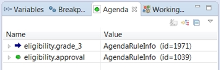
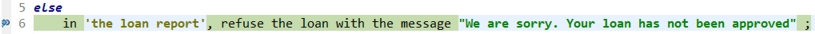
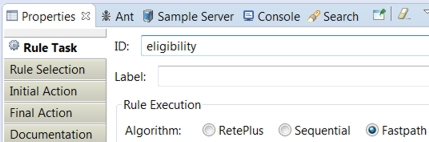
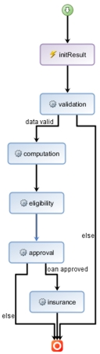
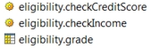
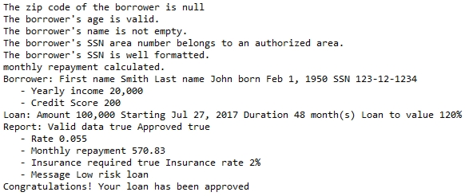

# Task 5: Debugging a ruleflow

You debug a ruleflow to determine why the decision table does not approve the loan. When you find the cause, you reorganize the ruleflow to achieve the correct results.

The decision service still rejects the loan. The rules run correctly now, so you decide to test the flow of decisions among the rules. You start by running a debugging session that associates the error with two rules. You determine that the rules reside in the same rule task in a ruleflow. This arrangement prevents one rule from processing information from the other rule. You reorganize the ruleflow by adding a rule task to make sure that the condition part of one rule takes into account the values that are computed in the action part of the other rule.

## Step 1: Debugging the ruleflow

You run a debugging session to determine the source of the error.

**Procedure**
1.   Run the run loan validation configuration in the Debug Configurations. The debugger stops at row 3 of the grade decision table.
2.   Open the **Agenda** tab in the Debug perspective. The tab shows two rules that are in the same eligibility rule task. The first entry points to the rule that is formed by row 3 in the grade decision table, and the second entry points to the approval action rule:

In the grade decision table, you see that an arrow points to the grade cell in row 3. The grade is B, and the message for the row is Low risk loan:

3.   Click the **Resume** button . The debugger stops on the `else` line in the approval action rule, which rejects the loan:

You open the Variables view and look for the `grade` value. You see that it is B as set in the grade decision table, but the action rule still goes to the else condition, which is for any grade other than A, B or C. The grade value in the approval rule is not set to B. The grade value is set in the decision table, but it is not seen by the action rule. This disconnect between the rules indicates a ruleflow problem. Both rules are probably in the same rule task. You look to see which algorithm is used by the rule task.

4.   Click the **Terminate** button  to stop the debugging session. 

## Step 2: Modifying the ruleflow

You open the eligibility rule task in the loanvalidation ruleflow. The task uses an algorithm that prevents the approval rule from seeing changes to data in another rule in the task. You decide to reorganize the ruleflow by creating a task, and moving the approval rule to the new task. Data can then flow from the old task to the new task, where the approval rule can then see the data changes.

**Procedure**
1.   Open the loanvalidation ruleflow in the Rule perspective. 
2.   Select the eligibility rule task. The rules in the **Agenda** tab are prefixed with eligibility, which is the name of the rule task.
3.   Open **Properties** \> **Rule Selection**, and expand eligibility. You see that the task contains both the approval action rule and the grade decision table.
4.   Open the **Rule Task** tab. You see that the Fastpath algorithm is selected:

You know that the Fastpath algorithm does not support inference. The agenda is computed once in the rule task, but it is not changed if variables are modified by other rules in the task. The approval rule runs with an unset grade value, and the value is not changed by the grade decision table.

To fix the error, you decide to create a rule task, and move the approval action rule to the new task. Then, you organize the transitions so that data from the eligibility task flows to the new task. This arrangement allows the approval rule to see the data from the grade rule, which remains in the eligibility task.

5.   Create a task node next to the insurance task in the ruleflow. 

Enter the following parameters in the properties for the new task:

    -   Rule Task ID: approval
    -   Rule Selection: eligibility.approval
6.   Click the transition line from the eligibility task to the end node, and reset it to run from the approval task to the end node. 
7.   Click the transition line from the eligibility task to the insurance task, and reset it to run from the approval task to the insurance task. 
8.   Create a transition line between the eligibility task and the approval task. 
9.   Click the **Layout All Nodes** button : The ruleflow now looks as follows:

10.  Edit the eligibility task to remove the approval action rule from the **Rule Selection** tab. Remove the eligibility package, and then import all the eligibility rules except the approval rule:

Now, the grade decision table runs in the eligibility task, and its grade value passes to the approval rule in the approval task.

11.  Save your work. 
12.  Run the decision service by using the run loan validation configuration in the Run Configurations. The decision service runs correctly, and produces the expected report:

13.  Remove all the breakpoints as shown at the end of Task 3, and save your changes. Your decision service now works correctly. You can now make the new version of the decision service available to the business user for further review. 

**Tip:** In this tutorial, you created a new rule task in a ruleflow, and changed the rule selection. This approach is not always possible. Alternatively, you can use inference by selecting the RetePlus algorithm in the Rule Task properties of the eligibility task.

You have completed the tutorial. It showed you how to add breakpoints, and use a debugging session to follow the breakpoints through a decision service to find problems in rules.

[ **Back to table of contents**](../README.md)

© Copyright IBM Corporation 2018

