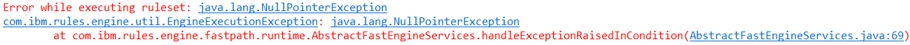
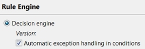
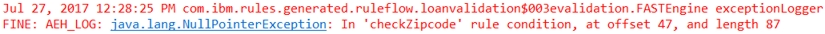

# Task 1: Using automatic exception handling

You want to see the results of the faulty decision service before you make any changes.

You import the decision service into Rule Designer, and then run it. The results show a null pointer exception in a rule condition. Before going further, you activate the automatic exception handling feature to see whether it can correct the exception.

## Step 1: Running the decision service

You import the start projects for the tutorial, and run the decision service.

If you have imported the answer projects to run the completed decision service, delete them before importing the start projects into the same Eclipse workspace.

**Procedure**
1.   Start Rule Designer on your computer in the en\_US \(American English\) locale. 
2.   Close the Eclipse welcome page if it open. 
3.   Open the Rule perspective if it is not open. Click **Window** \> **Open Perspective** \> **Other** \> **Rule** to open the perspective. 
4.   Import the start project that you downloaded from GitHub: 

a.  In the Rule perspective, click **File** \> **Import**.

b.  In the Import wizard, expand **General** \> **Existing Projects into Workspace**, and click **Next**.

c.  Choose Select root directory, and browse to <InstallDir\>/start. InstallDir is the name of the directory to which you downloaded the start project from GitHub.

d.  Click **Select All**, and in Options, click **Copy projects into workspace**.

e.  Click **Finish**.

The Rule Explorer displays six projects:

The Java™ project loan-validation-xom defines an execution object model \(XOM\) for rule execution. The main decision service, Loan Validation Service, references the other projects.

5.   From the **Run** menu, select **Run Configurations**. 
6.   Expand **Decision Operation**, select the run loan validation configuration, and click **Run**. 

The Console view shows the results, which include the following exception error:

## Step 2: Applying automatic exception handling

Because the exception occurs in a rule condition, you decide to try to fix it by using automatic exception handling.

**Procedure**
1.   In the Rule Explorer, right-click Loan Validation Service. 
2.   In the pop-up menu, click **Properties**, and select **Rule Engine** in the left column of the **Properties** dialog. 
3.   Select **Automatic exception handling in conditions**, and then click **OK**: 

4.   Run the run configuration that is shown in step 1 of this task. The results no longer show an exception error. The decision engine automatically handles the exception. To determine where the exception takes place, you add more logging information to the results.

## Step 3: Adding exception handing logging

You add additional logging information to determine where the decision engine automatically handles the exception error. First, you look at the file, and set it as the logging configuration file. Then, you set the Java VM parameter of the run configuration to declare the path to the logging configuration file.

**Procedure**
1.   In the Rule Explorer, double-click Loan Validation Service/logging.properties. The file sets the Console as a logging handler:

    handlers = java.util.logging.ConsoleHandler

It also sets the log level for the automatic exception handling to `FINE`.

2.   Open **Run** \> **Run Configurations**, and select the run loan validation configuration. 
3.   Open the **Parameters and Arguments** tab, and add the following VM argument: 

    
    -Djava.util.logging.config.file="${workspace_loc}/Loan Validation Service/logging.properties"
    

4.   Click **Apply**, and then click **Run**. The Console shows the results, which include a log message for the automatic exception handling:

The results tell you that the exception takes place in a condition in the checkZipcode rule.

In the next task, you add breakpoints to a ruleflow to determine where the exception handling occurs.

[**Next** ](../tut_cloud_rd_debug_ghtopics/tut_cloud_rddebug_bp_lsn.md)

[ **Back to table of contents**](../README.md)

© Copyright IBM Corporation 2018

